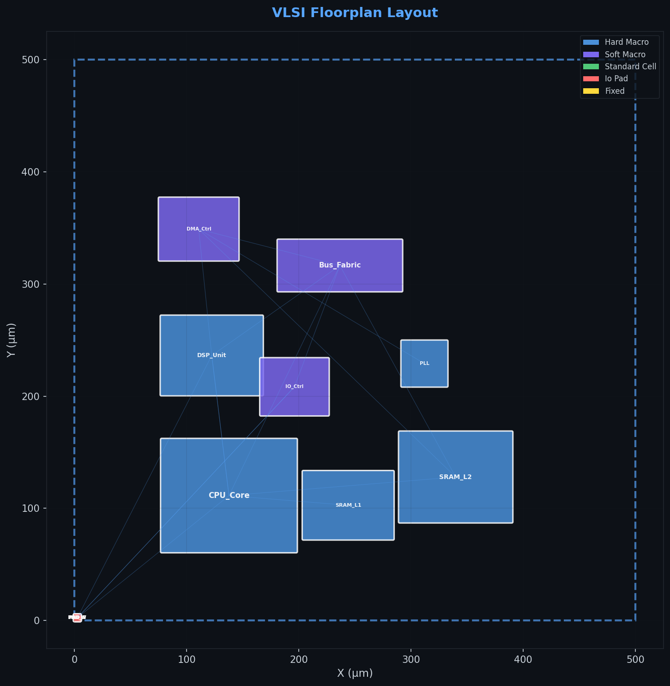
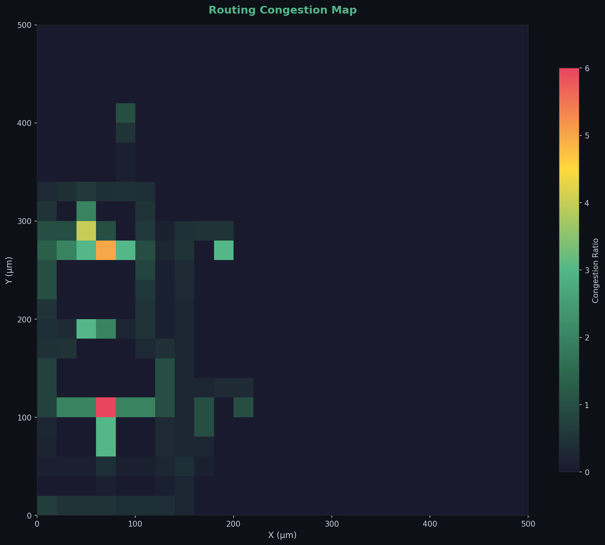
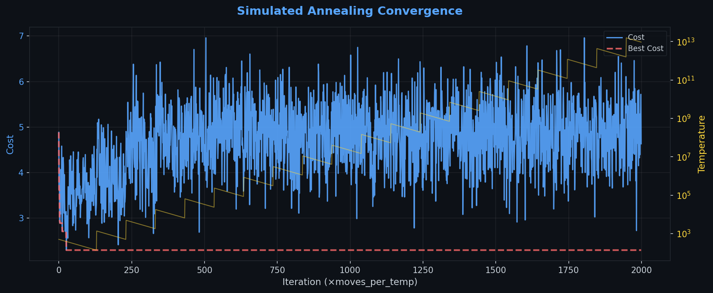

# 🔧 VLSI EDA Toolkit

> **A Python-based VLSI Physical Design Automation Framework**

A comprehensive, from-scratch implementation of core EDA (Electronic Design Automation) algorithms for VLSI physical design. Built for research, education, and algorithmic exploration.

[](https://www.python.org/downloads/)
[](https://www.gnu.org/licenses/gpl-3.0)
[](https://doi.org/10.5281/zenodo.18693046)
[](https://doi.org/10.5281/zenodo.18694705)

---

## 📋 Overview

This toolkit implements the **complete VLSI physical design flow** in pure Python:

```
Netlist Parsing → Floorplanning → Global Routing → Static Timing Analysis → Visualization
```

### Key Features

| Module | Description | Algorithm |
|--------|-------------|-----------|
| 📄 **Parser** | Multi-format benchmark reader | MCNC, YAL, JSON, Random Generation |
| 📦 **Floorplanner** | Macro-block placement | Simulated Annealing + PIAB-FP (Physics-Inspired) |
| 🔌 **Router** | Global routing | A* with congestion-aware cost |
| ⏱️ **Timing** | Static Timing Analysis | DAG-based forward/backward propagation |
| 🎨 **Visualizer** | Publication-quality plots | Floorplan, thermal, congestion, dashboards |

---

## 🏗️ Architecture

```
vlsi-eda-toolkit/
├── src/
│   ├── core/                    # Data structures
│   │   ├── cell.py              # Cell, Pin, CellType
│   │   ├── net.py               # Net with HPWL/Star wirelength
│   │   ├── netlist.py           # Netlist container
│   │   ├── floorplan.py         # Floorplan evaluation
│   │   └── design.py            # Top-level design object
│   ├── parser/                  # Benchmark parsers
│   │   └── benchmark_parser.py  # MCNC, YAL, JSON, random gen
│   ├── floorplanner/            # Placement algorithms
│   │   ├── simulated_annealing.py  # Classical SA floorplanner
│   │   ├── piab_fp.py           # Physics-Inspired Agent-Based
│   │   └── cost.py              # Multi-objective cost function
│   ├── router/                  # Routing algorithms
│   │   └── global_router.py     # A*-based global router
│   ├── timing/                  # Timing analysis
│   │   └── sta.py               # Static Timing Analysis engine
│   └── visualizer/              # Visualization
│       └── layout_viewer.py     # Matplotlib-based viewer
├── benchmarks/                  # Test cases
├── examples/                    # Usage examples
├── tests/                       # Unit tests
├── output/                      # Generated plots
└── README.md
```

---

## 🚀 Quick Start

### Installation

```bash
git clone https://github.com/saieshkhadpe11/vlsi-eda-toolkit.git
cd vlsi-eda-toolkit
pip install -r requirements.txt
```

### Run the Full Flow

```bash
python examples/run_full_flow.py
```

This runs the complete pipeline and generates visualizations in the `output/` directory.

### Quick Python Example

```python
from parser.benchmark_parser import BenchmarkParser
from floorplanner.simulated_annealing import SimulatedAnnealingFloorplanner
from visualizer.layout_viewer import LayoutViewer

# Generate a random benchmark
parser = BenchmarkParser()
design = parser.generate_random(num_cells=20, num_nets=30, seed=42)

# Run Simulated Annealing
sa = SimulatedAnnealingFloorplanner(design)
result = sa.run()
print(f"Best cost: {result.best_cost:.4f}")

# Visualize
viewer = LayoutViewer(design)
viewer.plot_floorplan("my_floorplan.png", show_nets=True)
viewer.plot_thermal_map("my_thermal.png")
```

---

## 🧲 Algorithms

### Simulated Annealing Floorplanner

Classical SA-based optimization with:
- **4 move types**: Translate, Swap, Rotate, Reshape (soft macros)
- **Adaptive cooling**: Adjusts rate based on acceptance ratio
- **Reheat mechanism**: Escapes local minima via temperature restart
- **Configurable cost**: Weighted wirelength, overlap, boundary, thermal

### PIAB-FP: Physics-Inspired Agent-Based Floorplanner

A novel approach where each cell is an autonomous agent subject to physical forces:

| Force Type | Purpose |
|-----------|---------|
| 🔴 Repulsive | Spring-like overlap resolution |
| 🟢 Attractive | Net-based connectivity pull |
| 🔵 Boundary | Elastic chip containment |
| 🟠 Thermal | Heat diffusion (hot blocks apart) |
| ⚪ Gravitational | Center-pull for compaction |

Uses **3-phase adaptive scheduling** (Coarse → Medium → Fine) with velocity damping.

### A*-Based Global Router

- Congestion-aware pathfinding with macro blockage
- Rip-up-and-reroute for overflow resolution
- Net ordering by criticality and bounding box

### Static Timing Analysis

- DAG-based forward/backward propagation
- WNS (Worst Negative Slack) and TNS (Total Negative Slack)
- Critical path identification and tracing
- Area-based cell delay + Manhattan wire delay model

---

## 📊 Output Examples

The toolkit generates publication-quality visualizations:

### Design Dashboard
*6-panel summary: floorplan, thermal map, design metrics, convergence, congestion, and area distribution*


### Simulated Annealing Floorplan
*Placed macro-blocks with cell labels, net connections, and chip outline*


### PIAB-FP Floorplan (Physics-Inspired)
*Agent-based placement result — cells spread by 5 physical forces for overlap-free layout*



### Thermal Heatmap
*Gaussian heat spreading from power-dense blocks — identifies thermal hotspots*


### Routing Congestion Map
*GCell congestion ratios — red zones indicate routing overflow*



### SA Convergence Curve
*Cost vs. iteration with temperature overlay — shows optimization trajectory and reheat events*



### PIAB-FP Convergence
*3-phase convergence: Coarse (spread) → Medium (organize) → Fine (compact)*


---

## 🧪 Testing

```bash
cd vlsi-eda-toolkit
pytest tests/ -v
```

---

## 📚 Concepts Demonstrated

This project demonstrates understanding of:

- **Physical Design Flow**: Parsing → Placement → Routing → Timing
- **Optimization**: Simulated Annealing, physics-based methods
- **Graph Algorithms**: A* search, DAG traversal, topological sort
- **VLSI Metrics**: HPWL, overlap, utilization, WNS/TNS, congestion
- **Software Engineering**: Modular design, unit testing, documentation

---

---

## 📖 References

1. Shahookar & Mazumder, "VLSI Cell Placement Techniques," *ACM Computing Surveys*, 1991
2. Kirkpatrick et al., "Optimization by Simulated Annealing," *Science*, 1983
3. Cong et al., "An Interconnect-Centric Design Flow for Nanometer Technologies," *Proc. IEEE*, 2001
4. Kahng et al., *VLSI Physical Design: From Graph Partitioning to Timing Closure*, Springer, 2011

---

## 🔖 Cite This Project

This project has two citable records on Zenodo:

| Type | DOI |
|------|-----|
| 📦 **Software** (code) | [](https://doi.org/10.5281/zenodo.18693046) |
| 📄 **Paper** (preprint) | [](https://doi.org/10.5281/zenodo.18694705) |

### Cite the Paper (recommended for academic use)

**BibTeX:**

```bibtex
@techreport{khadpe_2026_vlsi_eda_paper,
  author       = {Khadpe, Saiesh},
  title        = {VLSI EDA Toolkit: A Python Framework for Physical Design
                  Automation with a Novel Physics-Inspired Agent-Based Floorplanner},
  year         = {2026},
  publisher    = {Zenodo},
  doi          = {10.5281/zenodo.18694705},
  url          = {https://doi.org/10.5281/zenodo.18694705}
}
```

**APA:**

> Khadpe, S. (2026). *VLSI EDA Toolkit: A Python Framework for Physical Design Automation with a Novel Physics-Inspired Agent-Based Floorplanner* [Technical Report]. Zenodo. https://doi.org/10.5281/zenodo.18694705

### Cite the Software

**BibTeX:**

```bibtex
@software{khadpe_2026_vlsi_eda_toolkit,
  author       = {Khadpe, Saiesh},
  title        = {VLSI EDA Toolkit: A Python-Based Physical Design Automation Framework},
  year         = {2026},
  publisher    = {Zenodo},
  version      = {v1.0.0},
  doi          = {10.5281/zenodo.18693046},
  url          = {https://doi.org/10.5281/zenodo.18693046}
}
```

---

## 📜 License


GPL-3.0 License — see [LICENSE](LICENSE) for details. This means you can use, study, and modify this code, but any derivative work must also be open-sourced under the same license and must credit the original author.

---

## 🤝 Contributing

Contributions welcome! Please open an issue or submit a PR.

1. Fork the repo
2. Create a feature branch (`git checkout -b feature/amazing-feature`)
3. Commit your changes (`git commit -m 'Add amazing feature'`)
4. Push to branch (`git push origin feature/amazing-feature`)
5. Open a Pull Request
